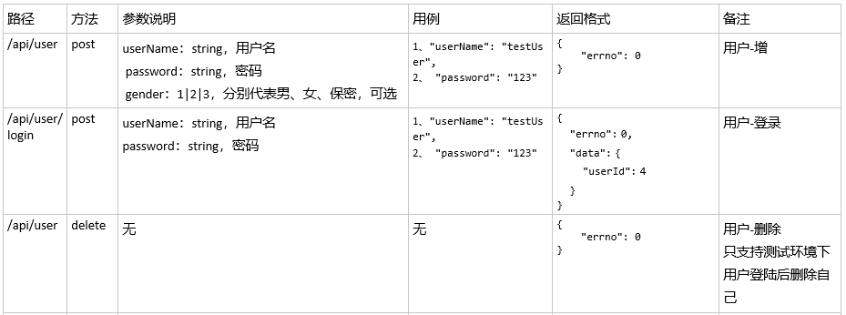
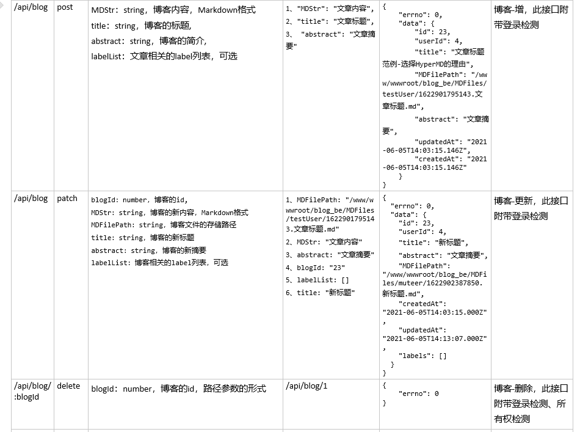
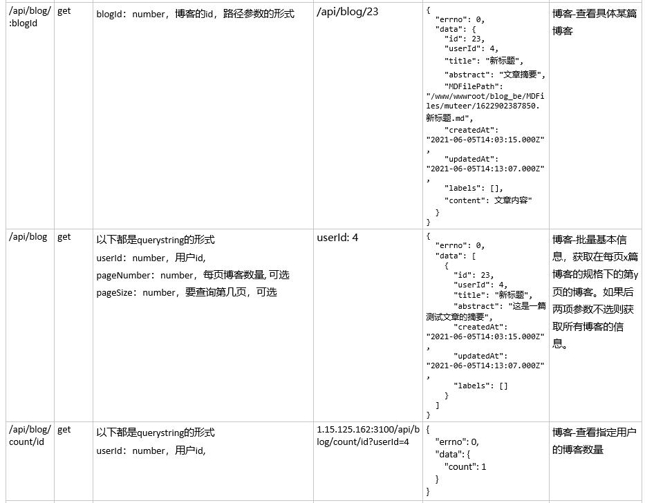
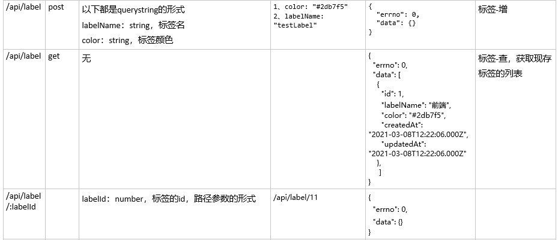
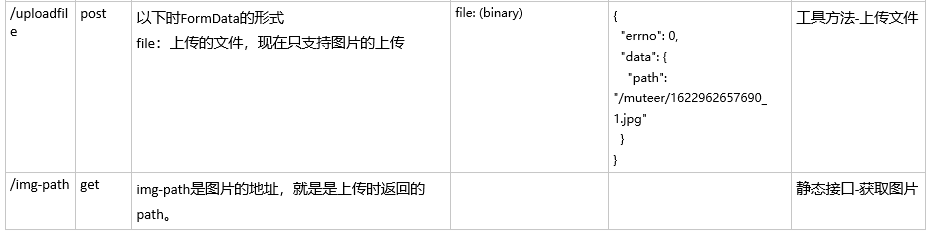

# 项目简介
## 概述
博客后端程序搭的作用是为博客前端页面、博客后台页面提供RESTful风格的HTTP接口，目前已经提供了博客、标签、用户、工具四类接口。  
博客后端程序使用了Node.js下的koa框架，搭配使用了koa框架常见的中间件，如koa-json、koa-body、koa-static、koa-redis等。同时为了缓存用户登录状态，搭配使用了redis。博客后端程序的相关数据存储使用了MySQL数据库和sequelize。
##  安装使用
### 使用依赖
此后端程序基于Node.js，因此可以跨端安装使用。在安装使用前要保证：
* 已经安装Node.js（程序中有使用fs的promise形式的API，因此最好使用最新的稳定版）
* MySQL（MySQL5.6以上），安装并且启动了服务。
* Redis（任意稳定版本皆可），安装并且启动。
### 安装过程
第一步，下载并安装依赖。
```
//下载后端程序
git clone https://github.com/WN921/blog_be.git

// 进入项目目录后，安装运行依赖
cd blog_be
npm install --registry=https://registry.npm.taobao.org
```

第二步，修改配置文件，并创建表格。
首先进入，项目下src/conf目录，打开db.js文件，修改其中REDIS_CONF和MYSQL_CONF两个对象。
以下是具体说明，线上和线下的配置根据需要自行配置：
```
let REDIS_CONF = {
    port: 6379,  //redis的默认端口，一般不用修改
    host: '127.0.0.1' //使用本地的redis，一般不用修改
}
let MYSQL_CONF = {
    host: 'localhost', //使用本地数据库，一般不用修改
    user: 'root',   //数据库的用户名
    password: '123456', //数据库的用户密码
    post: '3306',  //MySQL的默认端口，一般不用修改
    database: 'koa2_blog_db'  //此database应该事先创建好
}
```

```
//在数据库中创建表格
cd src/db
node sync.js
```
第三步，启动项目，这里的命令行实质使用了nodemon，方便进行开发。如果是线上，应该使用PM2。
```
//开发模式下启动项目
npm run dev

//线上环境，命令行启动项目并且使用PM2守护进程，也可以使用其他工具启动PM2
npm run prd
```

经过以上过程后，已经可以通过postman测试接口，但是**如果是想要以前后端分离模式下的使用，需要处理CORS，在项目中设置允许访问的源**，这部分见于下方。
## 后端接口
### 用户相关接口

### 博客相关接口


### 标签相关接口

### 工具相关接口


## CORS设置
跨源设置是前后端分离部署下的基础问题，这需要前后端都进行设置。就后端程序而言，设置很简单：  
* 打开项目下，src/middlewares/CORS.js文件，找到其中URLs数组。
* 将需要前端页面的源以URL的形式追加到数据末尾。
* 保存然后重新启动项目，进行测试是否成功。